# Draw.io Architecture Libraries

Reusable **draw.io / diagrams.net libraries** for creating **clean, consistent, and professional architecture diagrams**.

This repository provides curated symbol libraries for **system design, cloud architecture, DevOps, and security diagrams**, optimized for clarity, reuse, and documentation quality.

---

## 🎯 Purpose

Architectural diagrams often fail due to:

- inconsistent symbols
- visual clutter
- lack of shared semantics

This project solves that by offering **standardized, reusable libraries** that help teams produce diagrams that are:

- easier to read
- easier to maintain
- easier to review

---

## 📚 Library Catalog

A visual catalog with descriptions and previews is available here:

👉 **[CATALOG.md](./CATALOG.md)**

Each library is independently usable and versioned.

---

## 📦 Included Libraries

 **Library** | **File** | **Preview** | **Notes** |
|:---|---|---|---|
| **Build Pipeline Shapes** | `libraries/Build_Pipeline_Shapes.xml` | 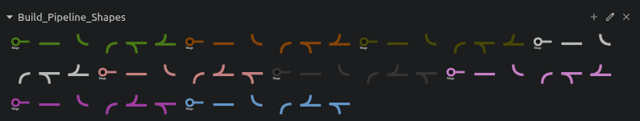 | Shapes allowing to build design diagrams for Build Pipelines. |
| **Dataflowdiagram Limited Shapes** | `libraries/DataFlowDiagram_Limited_Shapes.xml` | 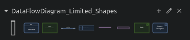 | Custom Data-flow diagrams shapes. |
| **Dataflowdiagram Shapes** | `libraries/DataFlowDiagram_Shapes.xml` | 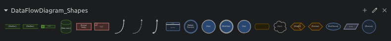 | Another variations of data-flow diagrams related shapes |
| **Additional Or Support** | `libraries/additional-or-support.xml` | 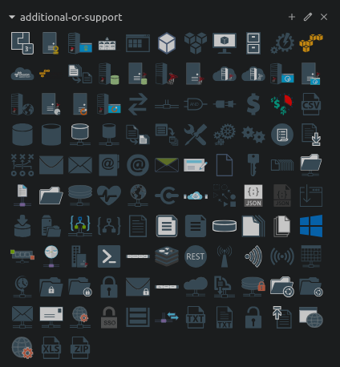 | Library contains generic additional shapes for design support. |
| **Ai Machine Learning** | `libraries/ai-machine-learning.xml` | 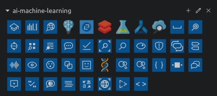 | Library contains AI machine learning shapes. |
| **Any Others** | `libraries/any-others.xml` | 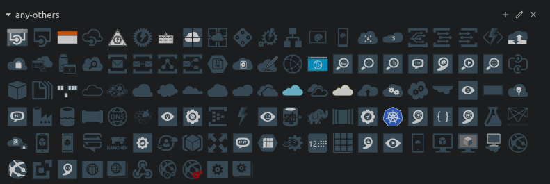 | Uncategorised shapes. |
| **Apache Software Foundation Logos** | `libraries/apache-software-foundation-logos.xml` | 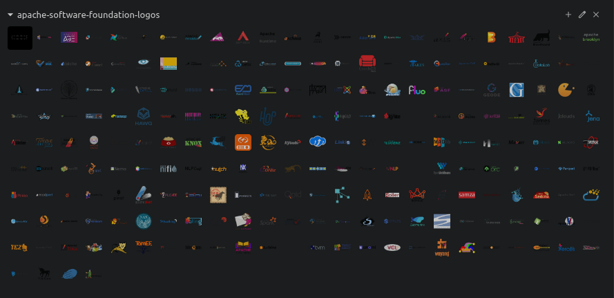 | Apache Software foundation shapes. |
| **Apps And Logos** | `libraries/apps-and-logos.xml` | 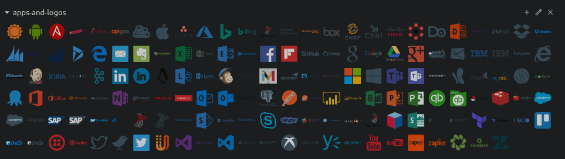 | Various apps and tools related logos. |
| **Aws Services** | `libraries/aws-services.xml` | 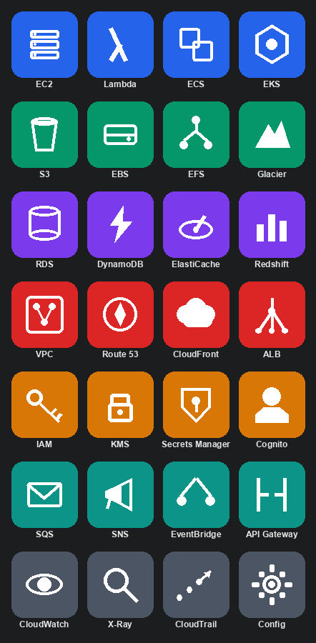 | Original pictogram icons for common AWS services, grouped and color-coded by category (compute, storage, database, networking, security, messaging, observability). Not AWS's trademarked icon artwork. |
| **Aws Services (3D)** | `libraries/aws-services-3d.xml` | 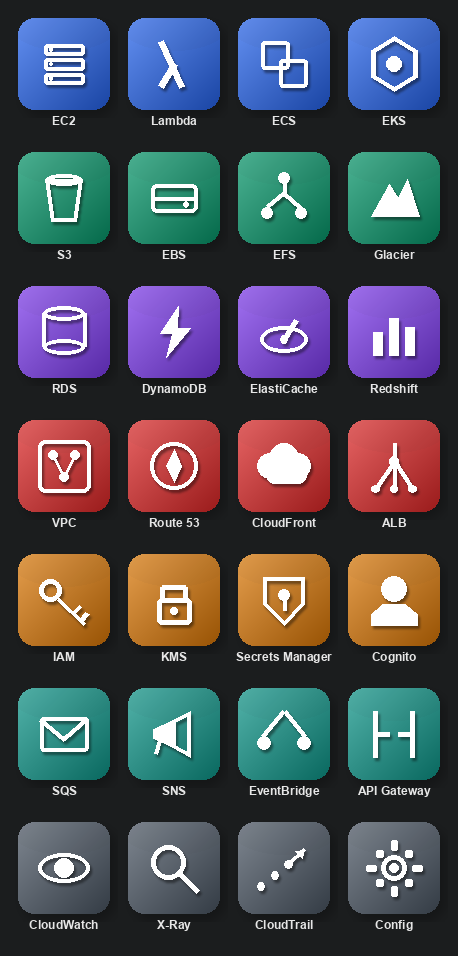 | Same 28 AWS service icons as `aws-services.xml`, rendered with a gradient fill, drop shadow, and glossy highlight for a raised, dimensional look. |
| **Azure Additional Or Support** | `libraries/azure-additional-or-support.xml` | 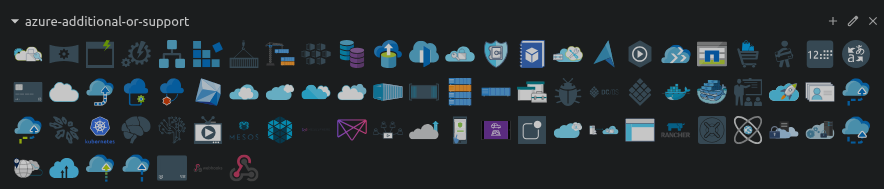 | Smaller (79-shape) supplementary Azure pack for adjacent concepts (automation, migration, containers, cloud adoption) not covered by Custom Azure. |
| **Buildings** | `libraries/buildings.xml` | 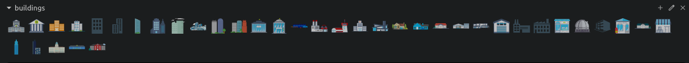 | Library contains building related shapes. |
| **C4 Model** | `libraries/c4-model.xml` | 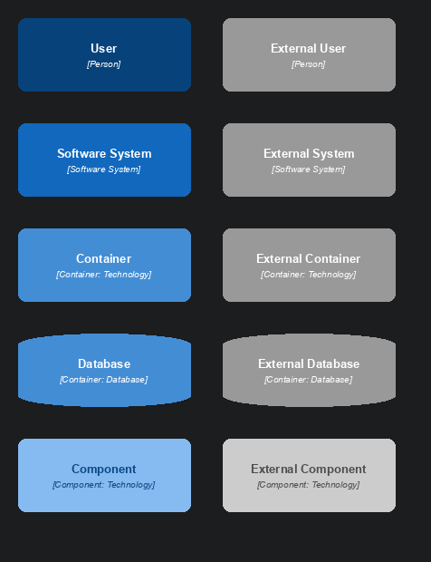 | Standard C4 notation shapes (Person, Software System, Container, Component, and boundaries), each in internal and external variants, for Context/Container/Component diagrams. |
| **Chart Icons** | `libraries/chart-icons.xml` | 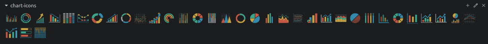 | Different chart icons. |
| **Custom Azure** | `libraries/custom-azure.xml` | 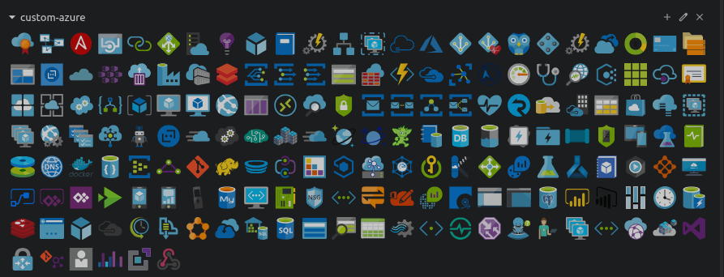 | Large (174-shape) core Azure service icon pack — the main Azure library; see Azure Additional Or Support for supplementary shapes. |
| **Kubernetes** | `libraries/custom-kubernetes.xml` | 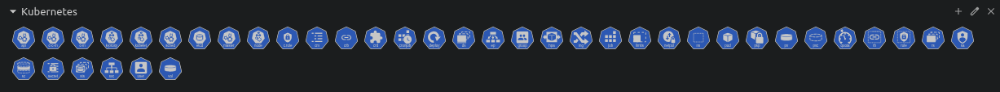 | Contains list of custom kubernetes icons. |
| **Databases** | `libraries/databases.xml` | 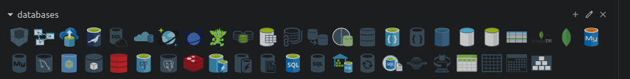 | List of various database tools. |
| **Delivery Icons** | `libraries/delivery-icons.xml` | 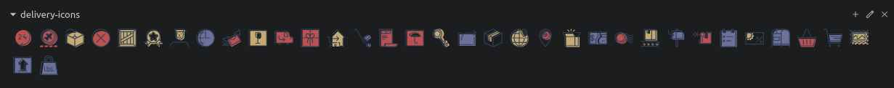 | Contains list of different delivery icons. |
| **Developer Tools** | `libraries/developer-tools.xml` | 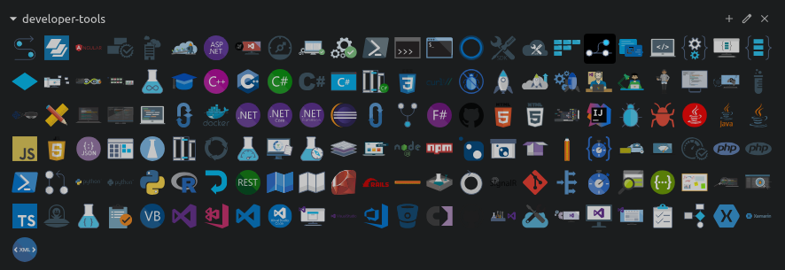 | Contains list of developer tools. |
| **Devices** | `libraries/devices.xml` | 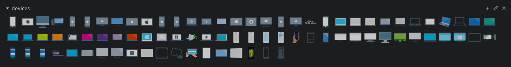 | Contains list of Devices. |
| **Flat Color Icons** | `libraries/flat-color-icons.xml` | 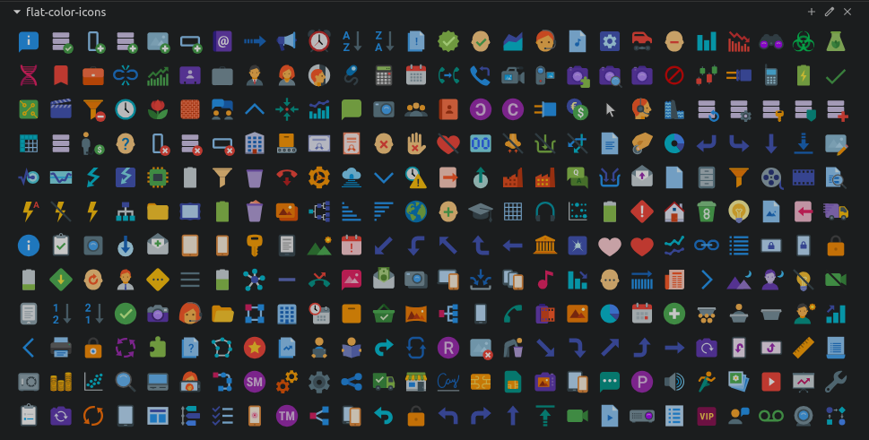 | Contains list of flat color icons. |
| **Font Awesome** | `libraries/font-awesome.xml` | 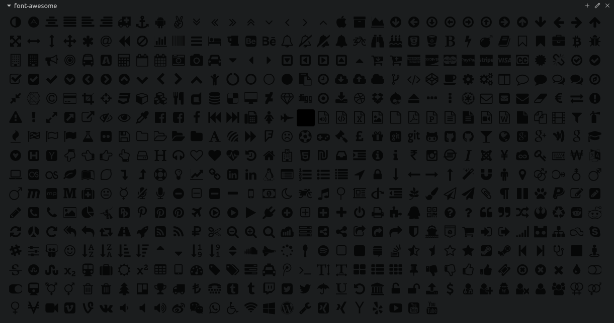 | Various Font Awesome icons. |
| **Gcp Services** | `libraries/gcp-services.xml` | 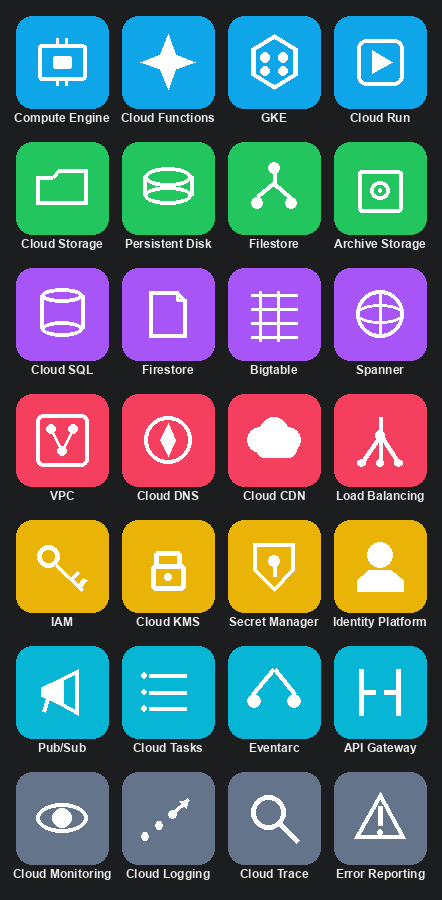 | Original pictogram icons for common Google Cloud services, grouped and color-coded by category (compute, storage, database, networking, security, messaging, observability). Not Google's trademarked icon artwork. |
| **Gcp Services (3D)** | `libraries/gcp-services-3d.xml` | 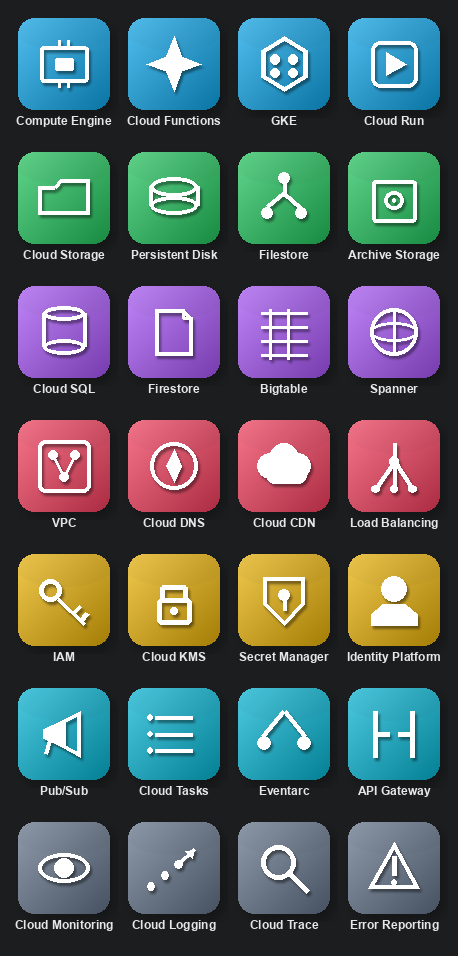 | Same 28 GCP service icons as `gcp-services.xml`, rendered with a gradient fill, drop shadow, and glossy highlight for a raised, dimensional look. |
| **Hashicorp Draw Io** | `libraries/hashicorp-draw-io.xml` | 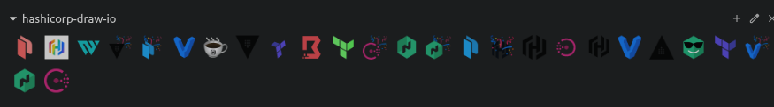 | Contains different Hashicorp tool icons. |
| **Integration Patterns** | `libraries/integration-patterns.xml` |  | 12 abstract Enterprise Integration Pattern icons (Aggregator, Router, Splitter, etc.) — conceptual, tool-agnostic notation, not tied to any specific product. |
| **Integration** | `libraries/integration.xml` | 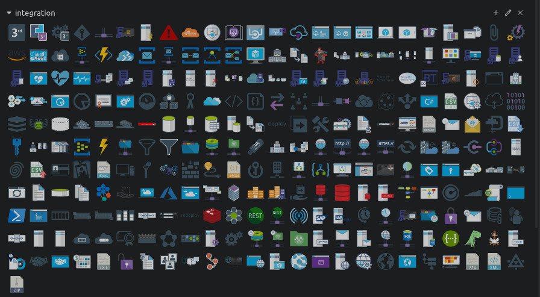 | Large (265-shape) icon pack for BizTalk Server and Azure integration tooling — adapters, protocols, Service Bus, Logic Apps, and related components. Product/tool-specific, unlike Integration Patterns. |
| **Office365** | `libraries/office365.xml` | 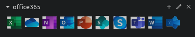 | Contains list of Office365 related icons. |
| **Osa Icons** | `libraries/osa-icons.xml` | 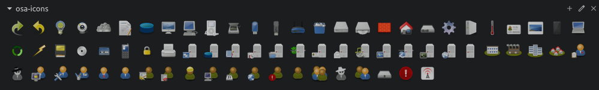 | Contains various OSA icons. |
| **Power Bi** | `libraries/power-bi.xml` | 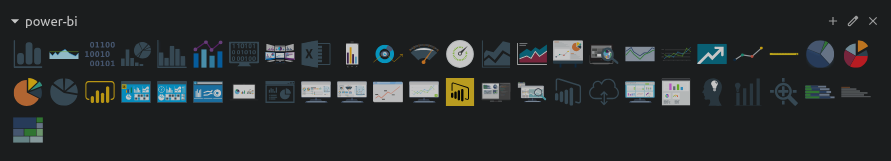 | Contains list of Power-BI icons. |
| **Powerapps And Flows** | `libraries/powerapps-and-flows.xml` | 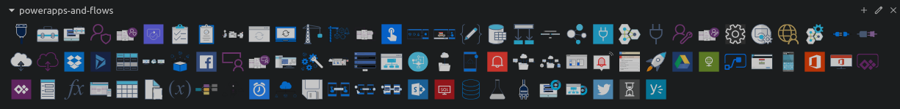 | Contains list of Power-apps and flows relatd icons. |
| **Users And Roles** | `libraries/users-and-roles.xml` | 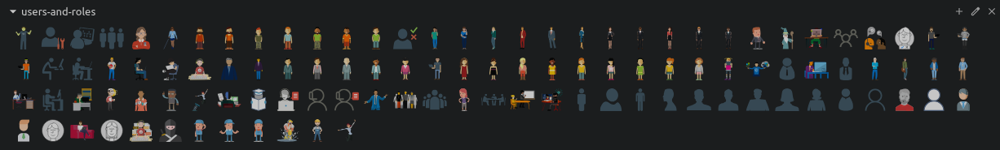 | Contains list of users and roles related icons for illustration purpose. |

> Libraries are intentionally **minimal and semantic** rather than exhaustive icon packs.

---

## 🚀 How to Use

### Option 1: Load a single library

1. Open **draw.io / diagrams.net**
2. Go to **File → Open Library from → Device**
3. Select the `.xml` library file
4. Drag symbols into your diagram

### Option 2: Use a release pack (recommended)

1. Download a release ZIP from **GitHub Releases**
2. Extract the libraries
3. Import one or more `.xml` files into draw.io

---

## 🧪 Examples

Ready-to-open sample diagrams built from these libraries live in [`examples/`](./examples):

| Example | File |
|---|---|
| CI/CD Pipeline | [`examples/ci-cd-pipeline.drawio`](./examples/ci-cd-pipeline.drawio) |
| Integration Patterns | [`examples/integration-patterns.drawio`](./examples/integration-patterns.drawio) |
| Kubernetes Microservices | [`examples/kubernetes-microservices.drawio`](./examples/kubernetes-microservices.drawio) |
| User Access Context | [`examples/user-access-context.drawio`](./examples/user-access-context.drawio) |

Open any file directly in draw.io / diagrams.net (**File → Open**) to see a complete diagram, not just individual shapes.

For a deeper walkthrough of the Data Flow Diagram libraries specifically, see [`docs/dfd_doc.md`](./docs/dfd_doc.md).

---

## 🧭 Design Principles

These libraries follow a few strict rules:

- **Architecture first** — symbols represent concepts, not vendors
- **Consistent sizing** — predictable alignment and spacing
- **Low visual noise** — diagrams stay readable at scale
- **Print & dark-mode friendly**
- **Tool-agnostic semantics** (works beyond draw.io)

---

## 🧩 Typical Use Cases

- System architecture diagrams
- C4 (Context / Container / Component) diagrams
- Cloud and infrastructure design reviews
- DevOps and CI/CD flows
- Technical documentation and RFCs
- Architecture review boards (ARB) material

---

## 📦 Releases & Versioning

This repository publishes **versioned release packs**.

Each release:

- is tagged (e.g. `v1.0.0`)
- includes a downloadable ZIP
- contains stable library definitions

👉 See [**GitHub Releases**](https://github.com/SaumilP/drawio_libraries/releases) for downloadable packs.

---

## 🤝 Contributing

Contributions are welcome, especially:

- new libraries with clear scope
- refinements to existing symbols
- visual consistency improvements
- documentation and examples

**Contribution guidelines:**

1. Keep symbols **semantic**, not vendor-marketing heavy
2. Avoid duplicating icons with different names
3. Prefer fewer, clearer symbols over large icon sets
4. Include a short description for catalog inclusion

---

## 🛣 Roadmap

- [X] Expand catalog previews
- [X] Add more C4-aligned symbols
- [ ] Add example diagrams per library
- [ ] Provide light/dark theme variants
- [ ] Improve cross-library consistency

---

## 📄 License

MIT License — free to use, modify, and distribute.

---

## ⭐ Why This Repo Exists

Good diagrams are a **force multiplier** for engineering teams.

This repository exists to make **clear architecture diagrams the default, not the exception**.
