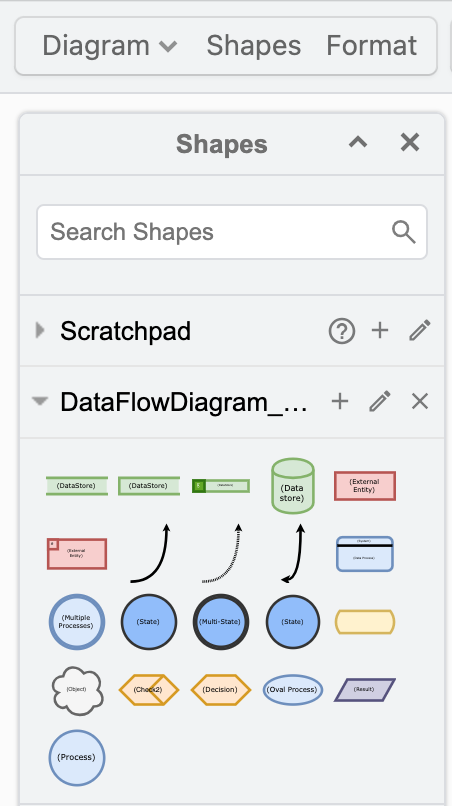
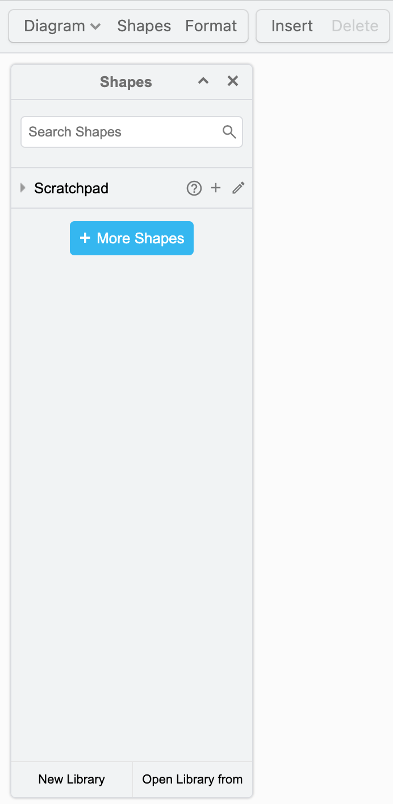

# Data Flow Diagram (DFD) Libraries

This repository ships two related libraries for building data-flow diagrams:

| Library | File | Best for |
|---|---|---|
| **Dataflowdiagram Limited Shapes** | `libraries/DataFlowDiagram_Limited_Shapes.xml` | Executive-level or high-level overviews. A reduced symbol set that keeps diagrams uncluttered. |
| **Dataflowdiagram Shapes** | `libraries/DataFlowDiagram_Shapes.xml` | Technical deep dives — ETL pipelines, integration flows, detailed system-to-system data movement. |

Both libraries follow standard DFD notation: external entities, processes, data stores, and labeled data flows between them.

## Preview

## How to Use

1. Open **draw.io / diagrams.net**
2. Go to **File → Open Library from → Device**
3. Select `DataFlowDiagram_Limited_Shapes.xml` or `DataFlowDiagram_Shapes.xml`
4. Drag entities, processes, and data stores onto the canvas and connect them with labeled flow arrows

## Choosing between the two

- Start with **Limited Shapes** if the diagram is meant for a non-technical audience or a one-page summary.
- Switch to the full **Shapes** library once you need to represent intermediate transformations, multiple data stores, or detailed process decomposition.
